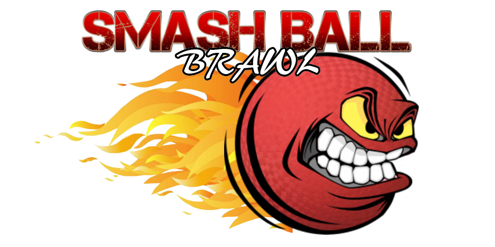

# Smash Ball Brawl

> A 3D multiplayer competitive shooter using ReactJS, Node, Express, ThreeJS (webGL), CannonJS, React Router, and Postgres.
Hosted at www.smashballbrawl.com




## Team

  - __Product Owner__: Eric Eakin
  - __Scrum Master__: Nick Lathen
  - __Development Team Members__: Will Stockman, Nick Lathen, Riyaz Ahmed

## Usage

`npm install`
`npm run build`
`npm start`

## Development

### Installing Dependencies

From within the root directory:

```sh
npm install
```